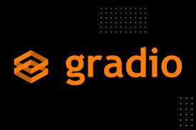
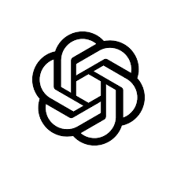
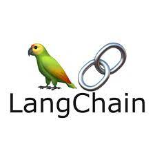
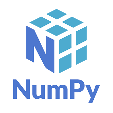
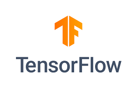

# Ponderadas de programação

## Atividade 1: Requisito não funcional

Ponderada da semana 2, consiste em aprofundar um requisito não funcional usado no projeto.

## Atividade 2: Launchs infinitos

Ponderada da semana 3, consiste em criar um pacote ros que lança o webots e o nav2 a fim de permitir o mapeamento e navegação do turtlebot3.

### Tecnologias:

[Ros](https://docs.ros.org/en/foxy/index.html) | [Webots](https://cyberbotics.com) | [Nav2](https://navigation.ros.org)
 :---: | :---: | :---: 
 |  |  

## Atividade 3: Chabot simples

Ponderada da semana 4, consiste em criar um pacote ros com um chatbot simples utilizando regex e nós.

### Tecnologias

[Ros](https://docs.ros.org/en/foxy/index.html) | [Regex](https://regexr.com) 
 :---: | :---: 
 |  

## Atividade 4: Construção de um chatbot com LLM

Ponderada da semana 5, consistem em criar um pacote ros com um chatbot contextualizado como um técnico de manutenção e uma interface simples.

### Tecnologias:

[Gradio](https://www.gradio.app) | [Openai](https://openai.com)
 :---: | :---: 
 |  

## Atividade 5: Construção de um chatbot com LLM e RAG

Melhorando a [Atividade 4](#atividade-4-construção-de-um-chatbot-com-llm), agora o chatbot precisa ser contextualizado com um pdf.

### Tecnologias:

[Gradio](https://www.gradio.app) | [Openai](https://openai.com) | [Langchain](https://www.langchain.com)
 :---: | :---: | :---:
 |  | 
  
## Atividade 6: Perceptron e portas lógicas

Implementação de um perceptron capaz de ser treinado para reproduzir o comportamento algumas portas lógicas.

### Tecnologia:

| [Numpy](https://numpy.org) | 
| :---: |

## Atividade 7: Classificação MNIST

Treinamento e utilização uma rede neural convolucional para classificar corretamente o dataset MNIST.

### Tecnologias

| [Numpy](https://numpy.org) | [TensorFlow](https://www.tensorflow.org/?hl=pt-br) |
| :---: | :---: |
 | 

## Atividade 8: Tradutor de áudio

Criação de uma ferramenta de terminal capaz de receber um áudio em português, *trascrevê-lo*, *traduzí-lo* para inglês e *reproduzir* um áudio em inglês.

### Tecnologias

| [gTTS](https://pypi.org/project/gTTS/) | [Google Translate](https://translate.google.com) |
| :---: | :---: |
 | 

## Atividade 9: Criando música com RNNs

Criação de uma musiquinha utilizando uma rede neural recorrente no [notebook do colab](https://colab.research.google.com/github/aamini/introtodeeplearning/blob/master/lab1/Part2_Music_Generation.ipynb).

## Atividade 10: Planejamento de fabricação digital

Descrição de um projeto que eu gostaria de fazer utilizando uma impressora 3D.

# Ponderadas de Matemática

## Matriz de mudança de base

Utilização de uma matriz de mudança de base.

## Números complexos

Prática de números complexos e suas operações.

## Quatérnions

Prática de quatérnions e suas operações.